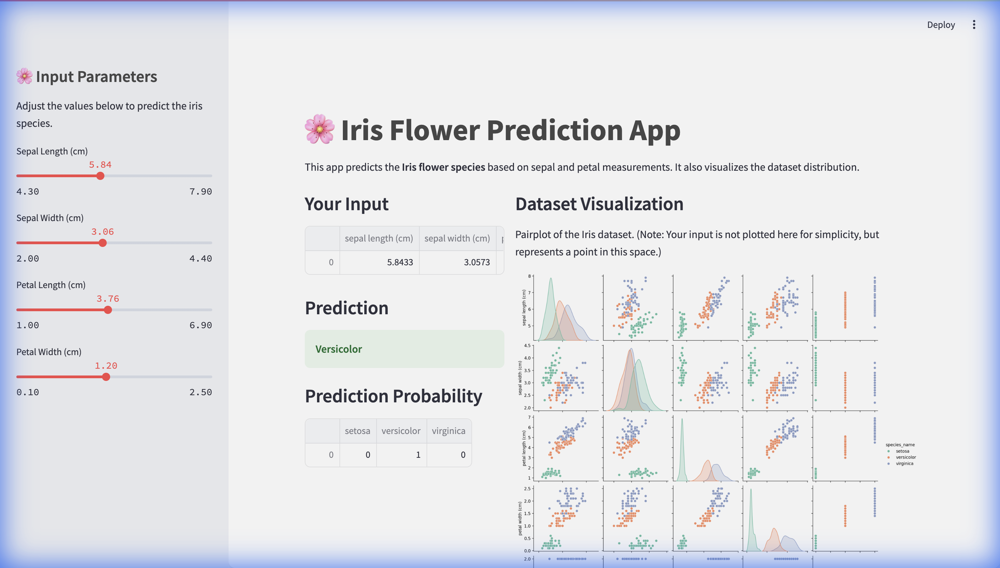

# 🌸 Iris Flower Prediction App

**A streamlined machine learning application for predicting Iris flower species.**

This application leverages a **K-Nearest Neighbors (KNN)** classifier to predict the species of an Iris flower based on its sepal and petal measurements. Built with **Streamlit**, it offers a reactive user interface for real-time inference and interactive data visualization.

---

## 📸 Demo

*The interface features intuitive sliders for input configuration and instant prediction results.*

---

## 🧠 Tech Stack & Skills

---

## 🚀 Key Features

- **⚡ Real-time Inference:** Experience instant predictions as you adjust the sepal and petal dimensions.
- **🎛️ Interactive Controls:** Use sidebar sliders to easily modify input parameters within the dataset's range.
- **📊 Probability Insights:** View the confidence level for each species (Setosa, Versicolor, Virginica).
- **📈 Dynamic Visualization:** Explore the dataset distribution with an interactive pairplot that helps visualize decision boundaries.

---

## 🔄 Modeling Workflow

The application operates on a robust machine learning pipeline designed for simplicity and accuracy:

1.  **📥 Data Ingestion:**
    The system loads the classic Iris dataset containing 150 samples across 4 features.
2.  **🎚️ User Interaction:**
    Users provide input via the sidebar interface, selecting specific dimensions for Sepal Length, Sepal Width, Petal Length, and Petal Width.
3.  **⚙️ Model Training:**
    A **K-Nearest Neighbors (KNN)** model (`k=3`) is trained on the entire dataset to ensure up-to-date accuracy.
4.  **🎯 Prediction & Analysis:**
    The model processes the user input to predict the most likely species and calculates probability scores for all classes.
5.  **📉 Visualization:**
    Results are presented alongside a Seaborn pairplot, offering visual context to the prediction.

---

## 📊 Dataset Visualization

To aid interpretability, the app generates a comprehensive **pairplot**. This visualization maps the relationships between features, color-coded by species, allowing users to intuitively grasp how the model distinguishes between *Setosa*, *Versicolor*, and *Virginica*.
